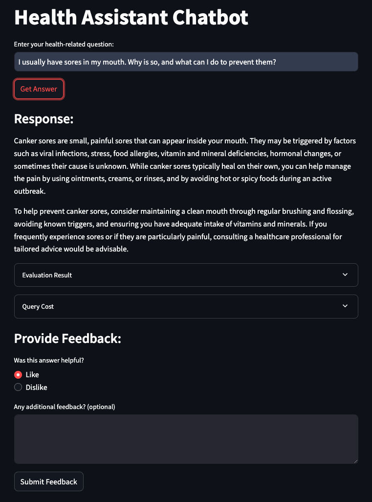
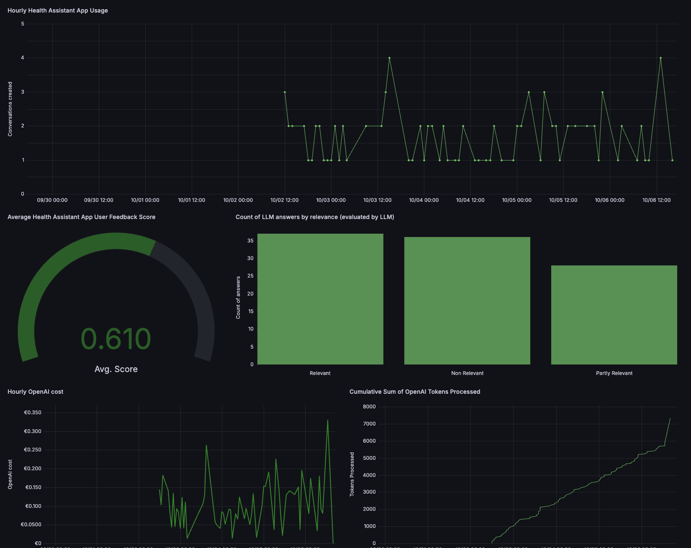

# Health Assistant
RAG system dedicated to answering health-related questions based on scientific evidence.

<p align="center">
  
</p>

## Project overview
The health-assistant project aims to develop a Retrieval-Augmented Generation (RAG) system, specifically for health-related questions. The system is designed to provide reliable, evidence-based responses by leveraging a dataset of medical question-answer pairs and employing advanced natural language processing (NLP) models. The main problem addressed by this system is the challenge of providing accurate and scientifically validated information in the domain of health, which is critical to avoid misinformation and enhance user trust.

The system is intended for individuals looking for reliable answers to health-related questions, healthcare professionals seeking quick references, or as an informative tool that users can integrate into existing health-related platforms. The use cases extend from patient self-assistance to integration into more complex healthcare systems as a resource for professionals or AI assistants. By combining retrieval of relevant documents and generative models, the health-assistant aims to mitigate the risks of hallucination in generated content and enhance factual correctness.

<p align="center">
  
</p>

## Dataset
This project utilizes the [MedQuAD dataset](https://www.kaggle.com/datasets/jpmiller/layoutlm), which can be found on Kaggle. The dataset consists of a collection of medical question-answer pairs designed to assist in creating NLP models that are capable of understanding and responding to a wide range of healthcare-related queries. The dataset includes multiple questions and answers, which are mapped to medical topics that span across various conditions, treatments, and patient concerns.

### Downloading the Dataset

To download the MedQuAD dataset from Kaggle, you will need to use the Kaggle CLI tool. Follow the instructions below to download the dataset and prepare it for usage in the health-assistant project.

1. Install the Kaggle CLI by following the [official documentation](https://www.kaggle.com/docs/api#getting-started-installation-&-authentication).

2. Authenticate your Kaggle account with your API token.

3. Run the following command to download the required dataset:
```sh
kaggle datasets download -d jpmiller/layoutlm -f medquad.csv && 
unzip medquad.csv.zip && 
rm medquad.csv.zip
```

Ensure that you have the appropriate permissions and access to download datasets using the Kaggle CLI. This dataset will be used as the basis for training the retriever and generating responses within the RAG system.

## Technologies
This project utilizes a variety of  technologies to ensure reliable performance, effective data handling, and seamless user interaction. Below is a summary of the technologies used:

- **Python 3.12**
- **Poetry**: Dependency management and packaging tool used to manage Python dependencies in a consistent and reproducible manner.
- **Streamlit**: Used to create the web interface for interacting with the health assistant chatbot, allowing users to input questions and receive responses in a user-friendly way.
- **OpenAI API**: Provides the language model capabilities used to generate responses based on user questions and retrieved context.
- **ElasticSearch**: Utilized for indexing and retrieving relevant medical content from the dataset, supporting both traditional keyword searches and dense vector-based semantic searches.
- **Sentence Transformers (Hugging Face)**: Specifically, the Alibaba-NLP/gte-large-en-v1.5 model is used to generate embeddings for questions and answers, which are critical for semantic search capabilities.
- **PostgreSQL**: Used as the primary database for storing and managing data related to user interactions, conversation logs, and feedback.
- **Grafana**: Employed for monitoring the application's performance and metrics, providing visualization dashboards to track key indicators such as usage, costs, and system health.
- **Docker & Docker Compose**: Used to containerize the application and its dependencies, simplifying deployment and ensuring consistent environments across different systems.

## Preparation
### OpenAI API Key Setup

This project uses the OpenAI API to generate responses, and you need to set up your API key to use the system. Follow these steps to get your API key and set it up for the project:

1. Go to [OpenAI's API website](https://platform.openai.com/api-keys).
2. Log in or sign up if you haven't already.
3. Create a new API key and copy it.
4. The project uses a ```.env``` file to store the API key and other environment variables.

A ```.env_template``` file is provided in the repository. You need to create a ```.env``` file by copying the template, and replacing the placeholders with your actual API key and other necessary configuration values.

### Installing Poetry and Dependencies

The project uses [Poetry](https://python-poetry.org/) for dependency management. Follow these steps to install Poetry and set up the dependencies:

1. **Install Poetry:**

   - You can install Poetry by running the following command:
        ```sh
        curl -sSL https://install.python-poetry.org | python3 -
        ```

   - If you're using macOS or Linux, you can also install Poetry via Homebrew:
        ```sh
        brew install poetry
        ```


2. **Install Dependencies:**

   - Once Poetry is installed, navigate to the project's root directory and run:
        ```sh
        poetry install
        ```

   - This command will create a virtual environment and install all required dependencies as specified in the ```pyproject.toml``` file.

## Running the application
### Generating embeddings
To generate embeddings for the health-assistant application, the generate_embeddings.py script is used. This script processes the MedQuAD dataset to create dense vectors for the question, answer, and combined question-answer text using the [Alibaba-NLP/gte-large-en-v1.5](https://huggingface.co/Alibaba-NLP/gte-large-en-v1.5) model from the Sentence Transformers library. The embeddings are created in parallel to improve efficiency, with the final output saved as a `.parquet` file.

These embeddings are essential for the retrieval mechanism used by the RAG system. However, the embeddings have already been generated and are provided in the `data/medquad_embeddings.parquet` file, so running this script is not required unless you want to regenerate them.

### Running with Docker-Compose
The easiest way to run the application is by using Docker Compose. This will start all necessary services, including the main application:
```sh
docker-compose up
```
### Running locally
If you prefer to run the application locally, start only the required services (PostgreSQL, Elasticsearch and Grafana) using Docker Compose:
```sh
docker-compose up postgres elasticsearch grafana
```
If you have previously started all services using ```docker-compose up```, stop the app container before running locally:
```sh
docker-compose stop app
```
Now you can run the app on your host machine. Since we use Poetry for dependency management, follow these steps:
1. Activate the Poetry environment:
```sh
poetry shell
```
2. Navigate to the project directory:
```sh
cd health-assistant
```
3. Set the necessary environment variables and run the app:
```sh
export POSTGRES_HOST=localhost
poetry run streamlit run app.py
```

### Running with Docker (without compose)
Sometimes, you may want to run the application in Docker without Docker Compose, for example, for debugging purposes.

1. First, prepare the environment by running Docker Compose as in the previous section.
```sh
docker-compose up postgres elasticsearch grafana
```
2. Next, build the Docker image:
```sh
docker build -t health-assistant .
```
3. And run it:
```sh
docker run -it --rm \
    --network="health-assistant_default" \
    --env-file=".env" \
    -e OPENAI_API_KEY=${OPENAI_API_KEY} \
    -e DATA_PATH="data/medquad.csv" \
    -p 5000:5000 \
    health-assistant
```

## Using the application
### Streamlit
The health-assistant application is served via a Streamlit web interface. Follow the steps below to use the Streamlit-based chatbot:

1. **Starting the Streamlit Application**

First, ensure you are in the active Poetry environment and have all dependencies installed. To run the Streamlit app, use the following command:
```sh
poetry run streamlit run app.py
```
This will start the Streamlit server, and you can access the application by navigating to http://localhost:8501 in your web browser.

2. **Using the Application**

- Once the Streamlit app is running, you will see a title labeled "Health Assistant Chatbot".
- Enter your health-related question in the input box labeled "Enter your health-related question:".
- Click the "Get Answer" button to receive an AI-generated response.

3. **Understanding the Output**

- After submitting your question, the app will display the response from the AI model under the "Response:" section.
- Optionally, additional information such as the evaluation result and the cost for the query (in terms of API usage) will be displayed in expandable sections labeled "Evaluation Result" and "Query Cost".

4. **Providing Feedback**

- Users can provide feedback on the response by selecting either "Like" or "Dislike" under the "Provide Feedback:" section.

- Additionally, users have the option to provide further comments in the text area.

- Click the "Submit Feedback" button to send your feedback, which will be processed by the orchestrator and stored for future improvements.

The Streamlit interface provides a user-friendly way to interact with the health assistant, ensuring that users can easily ask questions and receive reliable, evidence-based responses.

## Code summary
- [`app.py`](health_assistant/app.py): Implements the Streamlit interface for user interaction with the health assistant chatbot.
- [`orchestrator.py`](health_assistant/orchestrator.py): Orchestrates the entire RAG flow by combining retrieval, generation, and evaluation components.
- [`database_manager.py`](health_assistant/database_manager.py): Manages interactions with the PostgreSQL database, including storing and retrieving data.
- [`elasticsearch_indexer.py`](health_assistant/elasticsearch_indexer.py): Manages indexing and search operations for the ElasticSearch database used in retrieval.
- [`search_service.py`](health_assistant/search_service.py): Provides retrieval services by interacting with ElasticSearch and other search backends.
- [`embedding_service.py`](health_assistant/embedding_service.py): Provides functionality to generate embeddings for input texts using a sentence transformer model.
- [`prompt_builder.py`](health_assistant/prompt_builder.py): Builds prompts used to query the language model based on retrieved context and user input.
- [`prompt_templates.py`](health_assistant/prompt_templates.py): Defines reusable templates for constructing prompts for the language model.
- [`llm_service.py`](health_assistant/llm_service.py): Interacts with the OpenAI API to generate responses based on the constructed prompts.
- [`response_evaluator.py`](health_assistant/response_evaluator.py): Evaluates the relevance and quality of the responses generated by the language model.
- [`logging_setup.py`](health_assistant/logging_setup.py): Configures the logging system used throughout the application for debugging and monitoring.
- [`cost_calculator.py`](health_assistant/cost_calculator.py): Calculates the OpenAI API usage costs for each query processed.
- [`app_tests.py`](health_assistant/app_tests.py): Contains unit and integration tests for validating the functionality of the Streamlit application.

## Experiments
### Retrieval evaluation
Before building the Streamlit-based RAG app, several retrieval evaluation methods were explored to determine the best retrieval mechanism for the health-assistant application. These methods included MinSearch and ElasticSearch, as well as the evaluation of different embedding models for performance and compatibility.
#### Retrieval Methods Evaluated
1. **MinSearch**

    MinSearch was one of the retrieval tools evaluated for its ease of integration and ability to efficiently index both text and keywords.
   - Using MinSearch, the documents from the MedQuAD dataset were indexed with fields such as "question", "answer", "source", and "focus_area".
   - The goal was to enable a fast, lightweight retrieval mechanism that could power the RAG pipeline with low latency.
2. **ElasticSearch**

    ElasticSearch was also evaluated as a potential candidate for retrieval. Two types of indices were set up:

   - **Text Index**: A traditional full-text search index that allowed for keyword-based matching.
   - **Vector Index (HNSW)**: A dense vector index for semantic similarity search. This index was created to allow retrieval based on the similarity of question-answer pairs using embedding vectors.
   - The text index was configured to store relevant fields such as "question", "answer", "source", and "focus_area". For the vector index, dense vectors were generated for the "question", "answer", and combined "question-answer" fields, with a similarity mechanism based on cosine distance using the HNSW algorithm for efficient nearest neighbor search.
   - This setup allowed for a more nuanced evaluation of the retrieval performance for both traditional search and semantic vector search.

**Embedding Model Choice**
- The embedding model used for creating dense vectors was the [Sentence Transformer from Alibaba-NLP](https://huggingface.co/Alibaba-NLP/gte-large-en-v1.5). This model was chosen based on its performance on the [MTEB leaderboard](https://huggingface.co/spaces/mteb/leaderboard), which evaluates embedding models across various tasks.
- Key considerations for selecting the embedding model included:
  - **Max Tokens**: The longest answer in the MedQuAD dataset contained 5,692 tokens, which informed the model choice and configuration to ensure token truncation was handled effectively.
  - **Vector Dimensions**: The embedding model output vectors were used to create dense vector indices, with the vectors being truncated to fit the dimensions required by the ElasticSearch vector index configuration.

**Results and Findings**
- **Hit Rate and Mean Reciprocal Rank (MRR):** Retrieval performance was evaluated by comparing retrieved answers against a set of ground-truth question-answer pairs.
  - Using ElasticSearch with vector indexing (HNSW), the retrieval achieved a **hit rate of 91.84% and an MRR of 0.759**. This highlighted the advantage of using semantic search for retrieving relevant information in the context of health-related questions.
- The evaluation informed the decision to implement the Retrieval-Augmented Generation (RAG) system using a combination of ElasticSearch and the chosen embedding model to ensure reliable and accurate retrieval performance, which significantly impacts the quality of generated answers.

### RAG flow evaluation
To ensure the effectiveness of the Retrieval-Augmented Generation (RAG) system, several evaluation tests were conducted on the RAG flow before finalizing the Streamlit app. These tests involved evaluating different prompt-building strategies and comparing the generated answers to known ground truth data. The tests focused on understanding the relevance, accuracy, and reliability of the responses, especially given the critical nature of providing health-related information.

**Tests Conducted**
1. **Prompt Versions Evaluation**

    The evaluation involved testing different prompt-building versions, each designed to retrieve relevant context and generate coherent answers to health-related queries.

   - The first version, referred to as the "Basic Prompt," used a straightforward format to combine the retrieved information and form a prompt for the language model.
   - A second, "Improved Prompt" version was also tested, which enhanced the quality of context and provided additional information about focus areas and sources for increased reliability and transparency.

2. **Evaluation Metrics**
   - **Relevance Categories**: The evaluation categorized the relevance of responses into "RELEVANT," "PARTLY_RELEVANT," and "NON_RELEVANT" based on the comparison to known ground truth answers.
   - **Comparison to Original Answers**: Tests were conducted to evaluate the similarity between LLM-generated answers and the original answers from the dataset. This was assessed using metrics such as hit rate and mean reciprocal rank (MRR).

3. **Results of RAG Flow Evaluation**
   - **Basic Prompt Evaluation**: The evaluation of the basic prompt resulted in an even split between responses that were categorized as either RELEVANT or PARTLY_RELEVANT. The main limitation was the occurrence of hallucinations and lack of specificity in some generated answers.
   - **Improved Prompt Evaluation**: The improved prompt led to a significant increase in the relevance of responses. The evaluation yielded the following breakdown:
     - **RELEVANT: 92.5%**
     - **PARTLY_RELEVANT: 6.5%**
     - **NON_RELEVANT: 1.0%**
   - The improved prompt also ensured transparency by explicitly stating if the retrieved context was insufficient to answer the question accurately. While this approach led to a small percentage of NON_RELEVANT answers, it enhanced honesty and reduced hallucinations—especially important for medical advice.

4. **Performance and Findings**

   - Overall, the improved prompt reduced the occurrence of hallucinations by making the language model more cautious in its responses, especially when the available context was insufficient.
   - The transparency in stating a lack of context was valued, particularly in the health domain, where the provision of misleading or hallucinated information can be harmful.
   - The final RAG system implementation used the improved prompt version to enhance factual correctness and user trust, contributing to a reliable health-assistant experience.

## Monitoring
### Dashboard
<p align="center">
  
</p>
The monitoring system for the health-assistant project is built using Grafana. After running the application with Docker Compose, Grafana can be accessed at http://localhost:3000. The Grafana instance provides a visual representation of the application's performance metrics and user interactions, helping monitor system health and identify issues.

The dashboard consists of the following five graphs:

1. **Hourly Health Assistant App Usage (Time Series)**

    This graph displays the number of distinct conversations created on an hourly basis. It provides insight into user activity and peak usage times, allowing for better scaling and load management.

2. **Average Health Assistant App User Feedback Score (Gauge)**
    
    This gauge graph shows the average user feedback score for the health assistant. The score ranges from 0 to 1, providing an overall measure of user satisfaction with the generated answers.

3. **Count of LLM Answers by Relevance (Bar Chart)**
    
    This bar chart displays the count of answers categorized by relevance as evaluated by the LLM. The relevance categories are "Relevant," "Partly Relevant," and "Non Relevant," which help track the quality of the responses provided by the system.

4. **Hourly OpenAI Cost (Time Series)**
    
    This graph represents the cumulative hourly cost of using the OpenAI API, allowing for budget tracking and ensuring that the API costs remain within expected limits.

5. **Cumulative Sum of OpenAI Tokens Processed (Time Series)**
    
    This time series graph shows the cumulative sum of tokens processed by the OpenAI API over time. It helps monitor resource utilization and provides insights into the volume of data being processed by the system.

### Setting up Grafana
Grafana is automatically set up when running the application with Docker Compose. To access Grafana, navigate to http://localhost:3000 in your web browser after starting the Docker Compose environment. By default, the credentials to log in to Grafana are admin for both the username and password (you may be prompted to change this upon first login). The pre-configured dashboard can be loaded from the [JSON file](grafana/health_assistant_dashboard.json) in the [grafana](grafana/) folder.